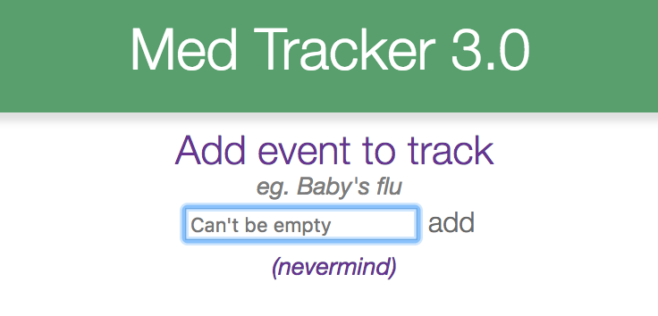
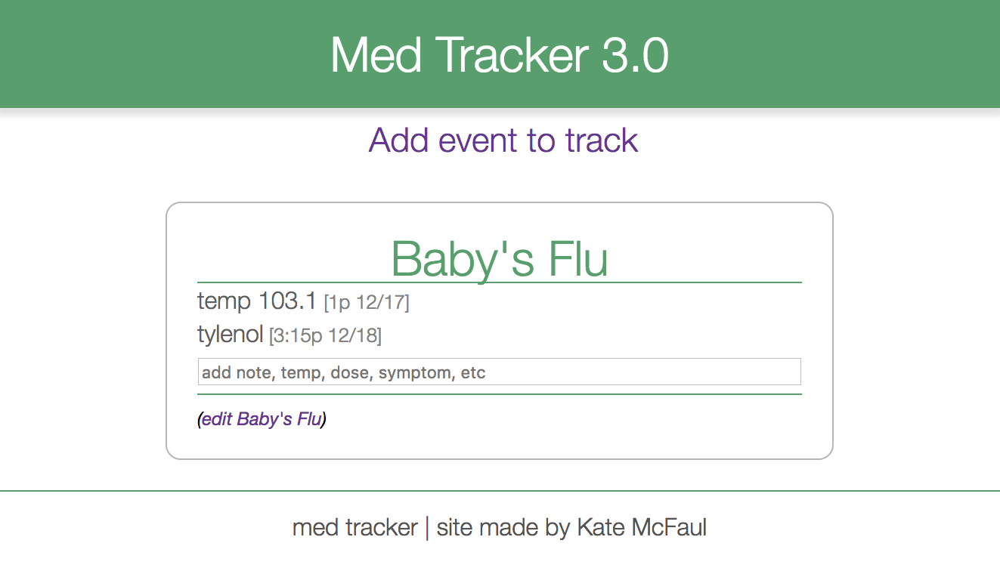
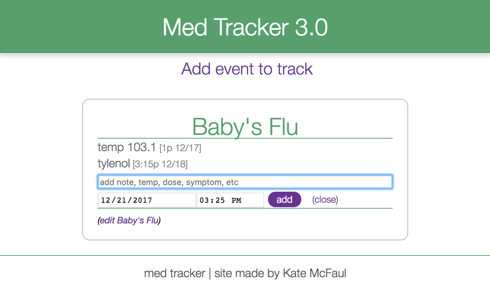
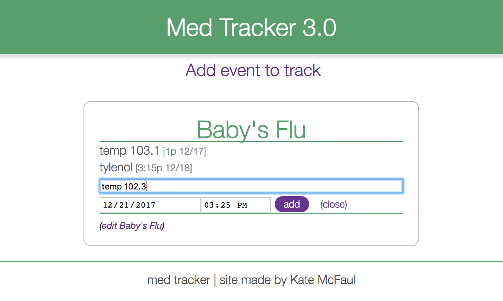
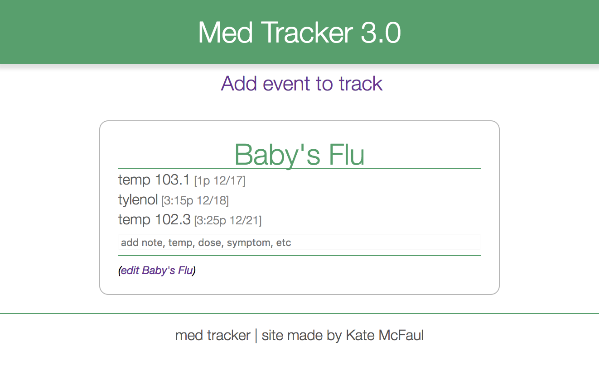
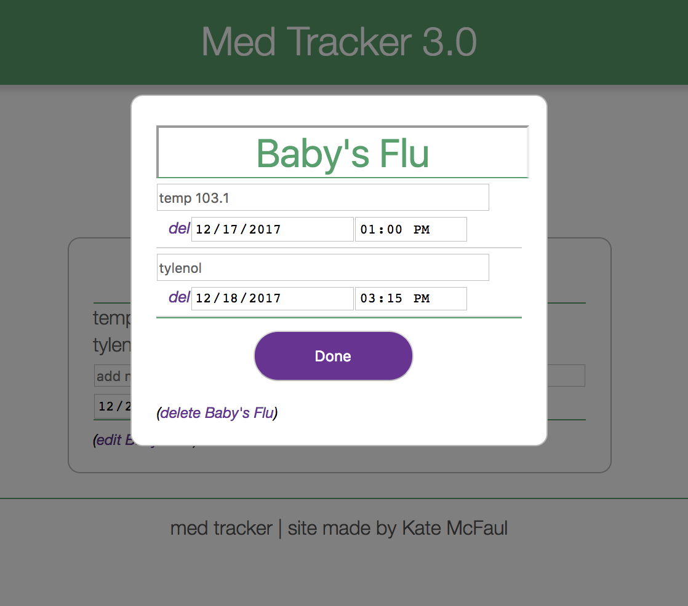

# Medicine Tracker

One place to keep track of all illnesses, medications for those illnesses, their instructions, ingredients, and when they were last given. Know when you last took a medicine, when you can take it again, and have active ingredients on hand for doctor visits. Track fevers, symptoms and take notes.

## Background

Every time my kids get sick I get a couple medicines and several instructions on when and how to give them. I keep a list of last doses on the fridge, but keeping all info on my phone would make it much easier.

I've been meaning to build myself an app like this for a long time, but after taking a React class I decided to practice my skills and build _new_ skills with this project.

This is just a personal project/ skill builder, not an app for the masses.

## How to Use

Got sick? Start a new illness to track:

(I used to call them "events", now I call them "illnesses", I didn't update the link)

From there you can add medicines you've taken, symptoms, notes, etc. Each item is timestamped so you can see when you last took a medicine.

Sample illness to track:


Adding a note drops down time fields and control buttons:




Note is saved and added with the others:


All fields are totally editable:


All information right now is stored in local storage on the user's browser. The potential issue here is that users could accidentally delete their data. Fortunately at this time, the app is made just for me, so this is not a current concern.

## Issues
This app currently works correctly in Chrome. Safari is giving me expected issues with time stamping. I need to rebuild how the time stamps are entered and stored. Also, my pop up for editing the illness doesn't scroll down if the records are longer than the screen. HOWEVER, this is mostly an app I'm building to practice React, so browser compatibility is not at the top of my priority list right now. Also, I'm actively learning so much every day, I expect I'll want to do a complete rewrite pretty soon to practice all my new knowledge.

## Ideas

Here's my vision for the app:

```
Kate's Ear Infection
------------------------
Amoxicilan (3hrs)  (add)      
[ 2 every 8 hrs        ]
[ take with food       ]
------------------------
Advil (now)        (add)
[ 1-2 every 6 hrs      ]
------------------------
temp 101.4 [7:45a 12/17]
amox       [9:00a 12/17]
dr appt    [2:00p 12/17]
etc
```

Kate’s Ear Infection could be one of the titles. And then below that would be a section for medications needed for that illness. Click on a med name it would drop down with notes on that med (like frequency and instructions) that hide again when you don’t need it. With timestamps the app can tell you when you can take your next dose. If you need Amoxicilan every 8 hours and it has been 5 hrs since your dose it will say (3 hrs) next to it. Which would save me trying to do math in the middle of the night to see if the baby can have more tylenol or not. If you hit a little (add) button next to amoxicilan it will populate the input fields with relevant info and start the countdown again until your next dose. Right now all data is saved in local storage on the browser which makes saving things long term impossible. And you can only access your data on the device you entered it on. Fixing that is on my list of things to tackle in the future.
